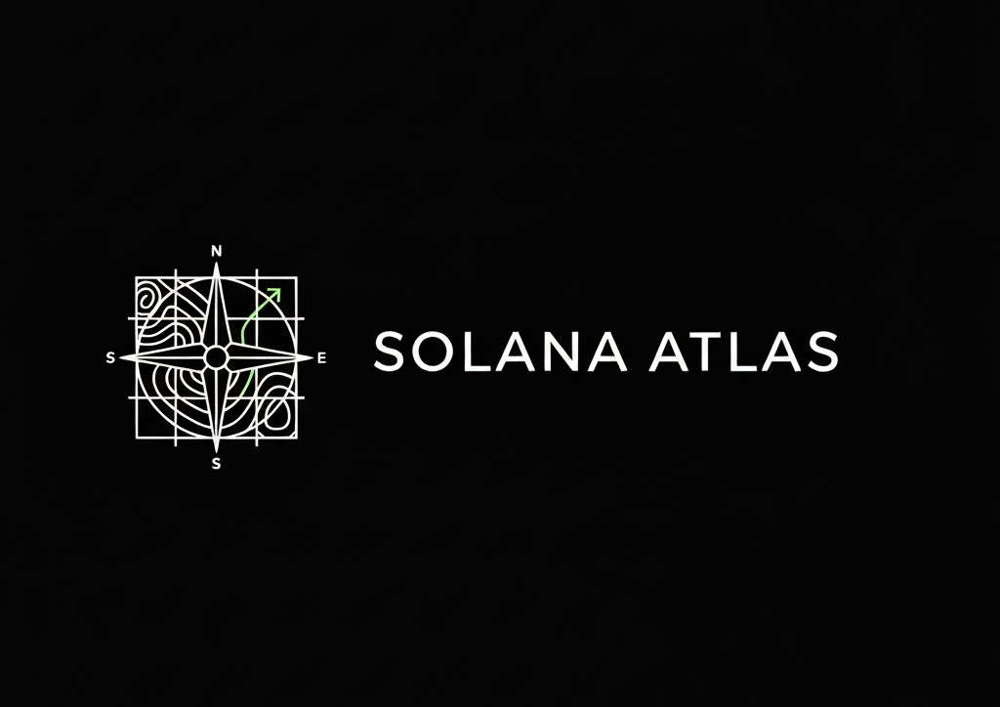

<p align="center">
  
</p>

# Solana Atlas

### A learning-first Solana developer playground

Solana Atlas helps developers understand Solana on-chain programs end-to-end using real, runnable code and clear, line-by-line explanations. It’s designed for developers who want to build strong **mental models**—not just copy-paste syntax.

---

## 🎨 Visual Showcase

### The Landing Experience

Modern, dark, and developer-centric. Get a bird's eye view of what's possible before diving into the code.


---

## 🚀 Key Features

### 💻 Integrated IDE

A seamless coding environment designed specifically for Solana programs. Write, compile, and explore in one place.


### 📖 Deep Explanations

Every important line of code is explained. Understand the **what**, the **why**, and the **risk** associated with every instruction.


### ✅ Interactive Checklists

Stay on track with program-specific checklists that guide you through building and understanding complex logic.


---

## 🛠 How it works

- **Curated Templates** – Carefully designed Solana programs, from basics to intermediate concepts.
- **Line-by-Line Explanations** – Every important line explains what it does and why it exists.
- **Program Map** – Visualize instructions, accounts, PDAs, and CPI calls.
- **State Viewer** – See on-chain account state before and after execution.
- **Safe Sandbox Execution** – Local validator with pre-computed and live execution modes.
- **Web-first Experience** – No wallet, no setup required to start learning.

### Included Templates (V1)

- **Hello Solana** (program structure & logging)
- **Account Initialization**
- **PDA Vault** (PDAs & lamports)
- **Basic SPL Token Mint**

---

## 🏗 Architecture

Monorepo powered by **Turborepo**:

```text
apps/
  web      → Next.js frontend
  api      → API layer
  runner   → Sandbox execution service

packages/
  solana   → Program templates & metadata
  types    → Shared types
  config   → Shared configs
```

---

## ⚡ Running locally

### Prerequisites

- Node.js 18+
- pnpm 8+
- (Optional) Solana CLI

### Setup

```bash
# Install dependencies
pnpm install

# Build packages
pnpm build

# Start development servers
pnpm dev
```

This starts:

- **Web app** → [http://localhost:3000](http://localhost:3000)
- **API** → [http://localhost:3001](http://localhost:3001)
- **Runner** → [http://localhost:3002](http://localhost:3002)

### Environment variables (minimal)

**apps/web**

```text
NEXT_PUBLIC_API_URL=http://localhost:3001
NEXT_PUBLIC_APP_URL=http://localhost:3000
```

**apps/api**

```text
PORT=3001
RUNNER_URL=http://localhost:3002
```

**apps/runner**

```text
PORT=3002
```

> [!NOTE]  
> Advanced integrations (OAuth, Gists, AI explanations) are optional and can be added later.

---

## 🌐 Live Playground

👉 **Live demo**: [solana-atlas.xyz](https://solana-atlas.xyz)

---

## 👤 Author

Built by **Abhijitam**  
🐦 Twitter / X: [@Abhijitam\_](https://x.com/Abhijitam_)

---

## 📊 Status

Solana Atlas is in **V1** and focused on learning clarity over feature count.  
Feedback, ideas, and future collaborators are welcome.
